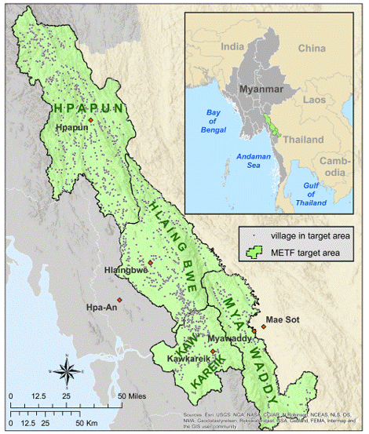
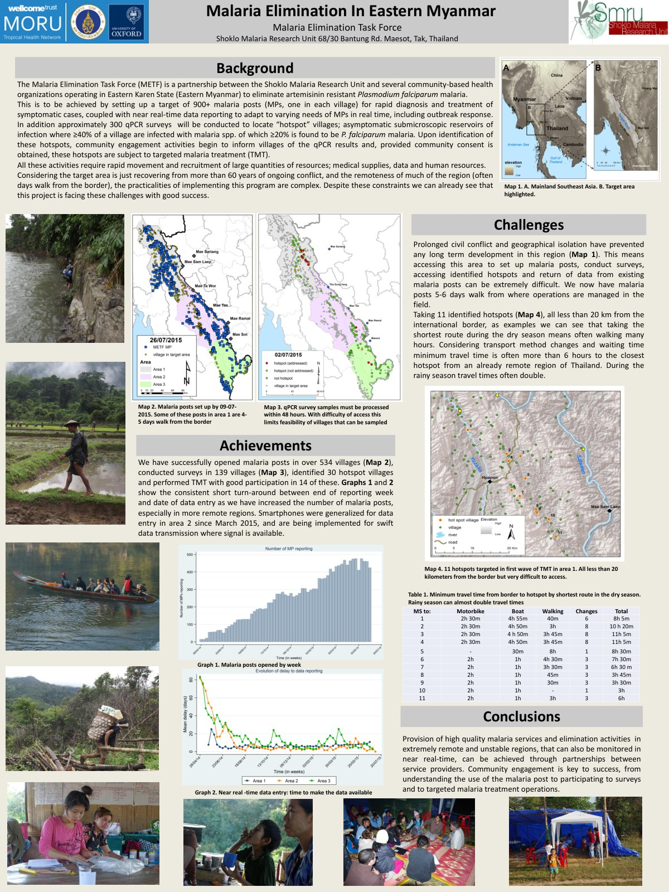

# METF-mapping — Karen State, Myanmar 

I focus here on the mapping component of METF because that was my primary contribution. While there were many other components to the METF program which I will link to separately, my role was as lead for the geospatial elements — so that is the emphasis in this repository.

The mapping program is also closely connected to other major research strands, including:
- The impacts of early diagnosis and treatment for *Plasmodium falciparum* malaria on malaria incidence
- The use of combination therapies for *P. falciparum*
- The use of targeted mass drug administration (tMDA) for *P. falciparum* elimination

Other repositories will document these other strands — particularly early diagnosis & treatment and tMDA — which both fed into and were influenced by METF’s operational model. Linking these will give a fuller picture of the program’s evolution and the shared lessons across initiatives.

Some of the broader history is detailed through interviews with François Nosten, for example:
- [How malaria defeats our drugs](https://wellcome.org/news/how-malaria-defeats-our-drugs)
- [Scientists race to eliminate malaria as ‘wonder drug’ loses its powers](https://www.cnn.com/2014/03/25/health/scientists-eliminate-malaria)
- [The Dour Frenchman on Malaria's Frontier](https://www.science.org/doi/10.1126/science.329.5996.1142)

---

## Gallery

<table>
  <tr>
    <td align="center" valign="top" width="50%">
      <!-- Map -->
      
       
      <b>Figure 1.</b> Map of METF target areas and villages in Kayin State (CC BY).
    </td>
    <td align="center" valign="top" width="50%">
      <!-- Old Poster (2015) -->
      
       
      <b>Old Poster (2015).</b> <i>Malaria Elimination, Myanmar</i>
       
      
    </td>
  </tr>
</table>

---
## Methods & Operations

**Mapping & GIS:**  
From 2013–2016, METF conducted three waves of mapping across Karen/Kayin State using GPS+GLONASS devices for high-accuracy coordinates. Field teams were composed of locally trained community members, with community engagement (CE) experts engaging politically sensitive or conflict areas beforehand.  
- **Wave 1 (2013–14):** Mapped malaria service presence, staffing, supply status, village names, and household counts.  
- **Wave 2 (2014):** Filled geographic gaps, corrected locations, and identified referral clinics.  
- **Wave 3 (2015–16):** Added basic economic and infrastructure indicators.  

Data from mapping forms were merged with GPS outputs to create a central GIS (ArcGIS 10.2, QGIS 2.4, R, Python). Each village was assigned an anonymous ID used across project data systems.

**Community Engagement (CE):**  
A dedicated CE team supported every stage—producing multilingual posters, audio announcements, and holding meetings with local leaders. CE activities preceded mapping, malaria post establishment, prevalence surveys, and mass drug administrations (MDAs). Engagement included village-wide meetings, group discussions tailored to sub-groups (women, school children, farmers, soldiers), and availability of mobile clinics and LLINs. Sensitive issues—like blood draw concerns or political mistrust—were addressed through dialogue with community leaders, clarifying the program’s independence from central government.

**Malaria Posts (MPs):**  
Following reconnaissance, the estimated need grew from ~800 to ~1,200 villages. Each MP was staffed by a trained, salaried local MP worker (MPW) and equipped with RDTs, antimalarials, basic medicines, pregnancy tests, scales, banners, and stationery. MPWs were selected by their communities and completed 5-day training in malaria case management, referrals, reporting, and CE, supported by bilingual manuals and treatment algorithms. These malaria posts were established on the foundation of evidence for early diagnosis and treatment (EDT) approaches — see [early-dx-tx](https://github.com/DMParker1/early-dx-tx) for background.

---

## Talks & Community Engagement

- **GIS for Mass Drug Administration** — short explainer video:  
  

- **Community Engagement Session** — discussion with Saw Poe Wah & Daniel Parker:  
  

---

## Additional Video Resources

- **Introduction to the Malaria Elimination Task Force (METF):**  
  

- **Mass drug administration for *falciparum* malaria (part of METF):**  
  

- **Combination therapies for malaria (part of METF):**  
  

- **Shoklo Malaria Research Unit (METF is part of SMRU):**  
  

---

## Publications

For a more complete list of METF-related publications — including titles, partial author lists, and space for summaries — see [publications.md](publications.md).

Key papers:
- Parker DM, Landier J, Thu AM, _et al._ [**Scale up of a *Plasmodium falciparum* elimination program and surveillance system in Kayin State, Myanmar**](https://doi.org/10.12688/wellcomeopenres.12741.2) 2017. *Wellcome Open Research* 2:98.   
- Landier J, Parker DM, Thu AM, _et al._ [**Effect of generalised access to early diagnosis and treatment and targeted mass drug administration on *Plasmodium falciparum* malaria in Eastern Myanmar: an observational study of a regional elimination programme**](https://doi.org/10.1016/S0140-6736(18)30792-X) 2018. *The Lancet* 391:1916–26. 

<!-- METF_REPORTS:START -->
## METF reports (SMRU)
_Auto-updated: 2025-10-01 09:33 UTC_

- [METF Activity Report Update May 2014 – December 2019 (PDF) (2019-12)](https://www.shoklo-unit.com/files/resources/reports/metf-report-2019.pdf)
- [METF Activity Report May 2014 - March 2018 (PDF) (2018-03)](https://www.shoklo-unit.com/files/resources/reports/metf-report-june-2014-apr-2018.pdf)
- [METF News bulletin (PDF) (2016-09)](https://www.shoklo-unit.com/files/resources/reports/metf_news.pdf)
- [METF Activity Report - May 2014 to December 2016 (PDF) (2016-03)](https://www.shoklo-unit.com/files/resources/reports/metf_monthly_epidemiological_report_mar2016.pdf)

<!-- METF_REPORTS:END -->

---

## 🔗 Related Repositories

These repositories connect different parts of my spatial epidemiology research:

- [spatial-epidemiology-hub](https://github.com/DMParker1/spatial-epidemiology-hub) — Umbrella repository tying together my career arc.  
- [earth-observation-hub](https://github.com/DMParker1/earth-observation-hub) — How Earth Observation methods became central to my work, with curated papers and case studies.  
- [activity-spaces](https://github.com/DMParker1/activity-spaces) — Research on multi-place exposure (farm huts, GPS, mobile phone data) and its health relevance.  
- [METF-mapping](https://github.com/DMParker1/METF-mapping) — Mapping malaria post placement & community engagement.  
- [tMDA-program](https://github.com/DMParker1/tmda-program) — Targeted mass drug administration trials & modeling.  
- [early-dx-tx](https://github.com/DMParker1/early-dx-tx) — Early access to malaria diagnosis & treatment.  
- [tm-border-mch](https://github.com/DMParker1/tm-border-mch) — Maternal and child health research on the Thailand–Myanmar border.  

---

---
